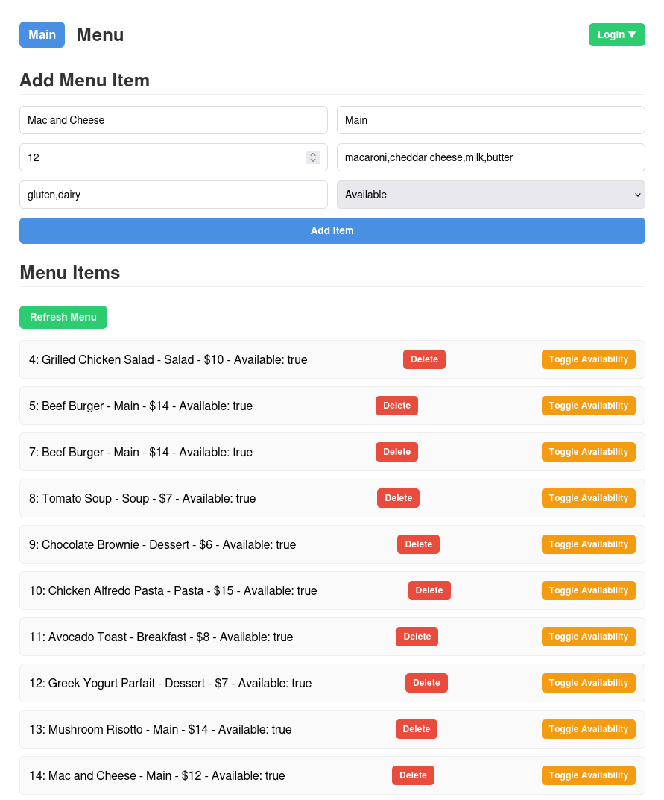
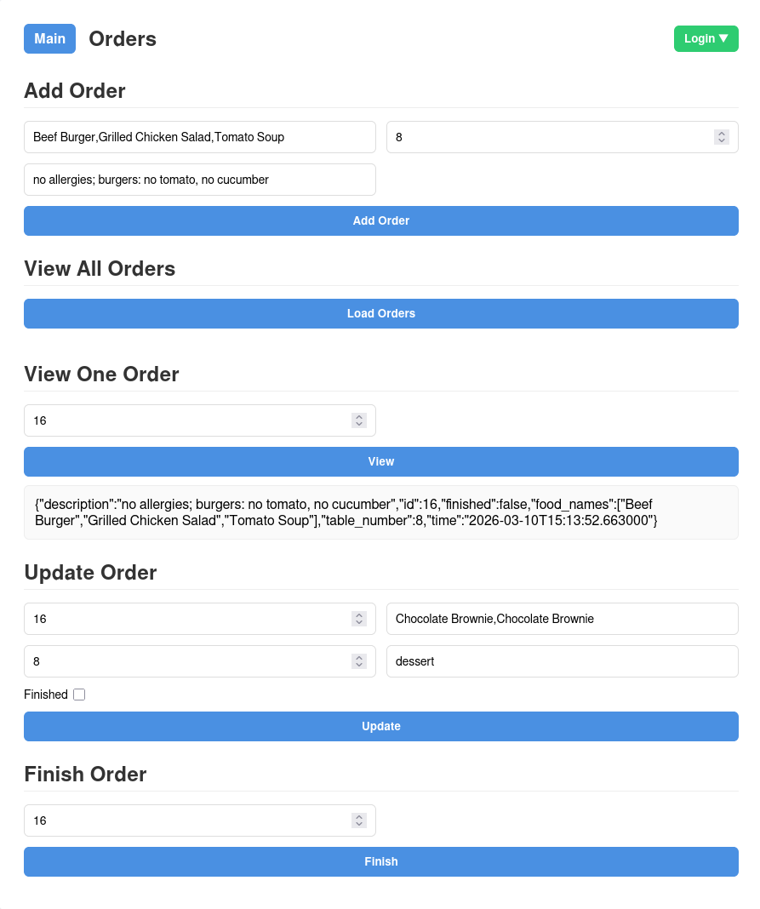
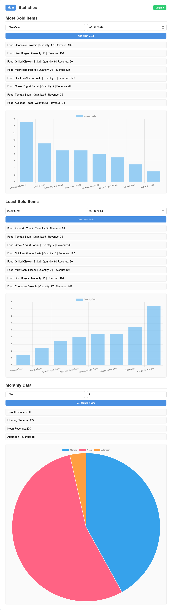

# Restaurant API

A FastAPI backend for managing a restaurant's menu, orders, and sales statistics.

<details>
<summary>Demos</summary>





</details>

## 🚀 Installation

<details>
<summary>Clone the repository and install dependencies</summary>

```bash
git clone https://github.com/wattox00/restaurantapi.git
cd restaurantapi
```

Create a virtual environment

<details>
<summary>Linux / macOS</summary>
  
  ```bash
  python -m venv .venv
  source .venv/bin/activate
  ```

</details>

<details>
<summary>Windows</summary>

```ps1
python -m venv .venv
.venv\Scripts\activate
```

</details>

Install dependencies

```bash
pip install -r requirements.txt
```

</details>

## ⚡ Running the Server
### Linux / macOS

```bash
./main.sh
```

### Windows

```ps1
.\main.ps1
```

Once running, the terminal will display clickable links to access the frontend or open the URLs manually. 

```bash
<path-of-the-cloned-repo>/frontend/index.html
```

## 🌐 Accessing the APIs manually

Menu: `http://127.0.0.1:8001`

Orders: `http://127.0.0.1:8002`

Statistics: `http://127.0.0.1:8003`

### 📄 Interactive API Documentation

Swagger UI: `/docs`

ReDoc: `/redoc`

# 🛠 Usage

Use the built-in HTML interface to explore routes, or interact via your own client.

```bash
<path-of-the-cloned-repo>/frontend/index.html
```

Workflow: Get the menu > Select items > Create order > Track orders > Complete orders > Check statistics.

View sales trends and graphs in the statistics tab.

## Mock data

Run the mock data scripts to generate sample data for the API.

Note: The mock data was generated on 2026-03-15, so statistics are only available starting from that date.

Make sure you are in the correct directory:

```bash
cd restaurantapi/mock
```

<details>
<summary>Linux / macOS</summary>

Menu mock:

```bash
chmod +x mock_menu.sh
./mock_menu.sh
```

Orders mock:

```bash
chmod +x mock_orders.sh
./mock_orders.sh
```

</details>

<details>
<summary>Windows</summary>
Use Windows Subsystem for Linux (WSL) and follow the linux/macos guide above

OR If Git Bash is installed, you can also run the scripts from PowerShell:

```bash
bash mock_menu.sh
```

For orders:

```bash
bash mock_orders.sh
```

</details>

## 🔒 Authentication

Uses basic JWT authentication.

### Default credentials for all login pages:

username: `admin`
password: `admin`

Feel free to change them as needed.

## 📦 Dependencies

<details>
<summary>Click to view</summary>

- fastapi[standard]

- uvicorn

- sqlalchemy

- python-jose[cryptography]

- passlib[bcrypt]

- python-multipart

</details>

## API Endpoints

<details>
<summary>Click to expand</summary>

### Menu Management

| Method | Endpoint | Description |
| ------ | -------- | ----------- |
| GET    | `/get_menu` | Get all menu items |
| POST   | `/new_item` | Add a new menu item |
| DELETE | `/delete_item/{id}` | Delete a menu item |
| PATCH  | `/patch_item/{id}` | Update a menu item |

### Orders

| Method | Endpoint | Description |
| ------ | -------- | ----------- |
| POST   | `/add_order` | Create a new order (JSON: `food_names: List[str]`) |
| GET    | `/view_orders` | Get all orders |
| GET    | `/view_order/{id}` | Get a specific order |
| PATCH  | `/update_odrder/{id}` | Update an order |
| PATCH  | `/finish_order/{id}` | Mark an order as finished |

### Statistics

| Method | Endpoint | Description |
| ------ | -------- | ----------- |
| GET    | `/most_items_sold` | Get most sold menu items |
| GET    | `/least_items_sold` | Get least sold menu items |
| GET    | `/monthly_data` | Get monthly sales data |
</details>

# Feel free to modify anything inside the app to suit your needs!

## ❤️ Support

If this project saved you time, taught you something, or made your day a little easier,
you can support its development here:

👉 **[Buy me a coffee via PayPal](https://www.paypal.com/paypalme/wattox)**

Your support helps keep the project:
- Actively maintained
- Continuously improved
- Free and open source

Thanks for being part of the community 🤝

## 📄 License

This project is licensed under the **MIT License**.  
See the [LICENSE](LICENSE) file for full details.
